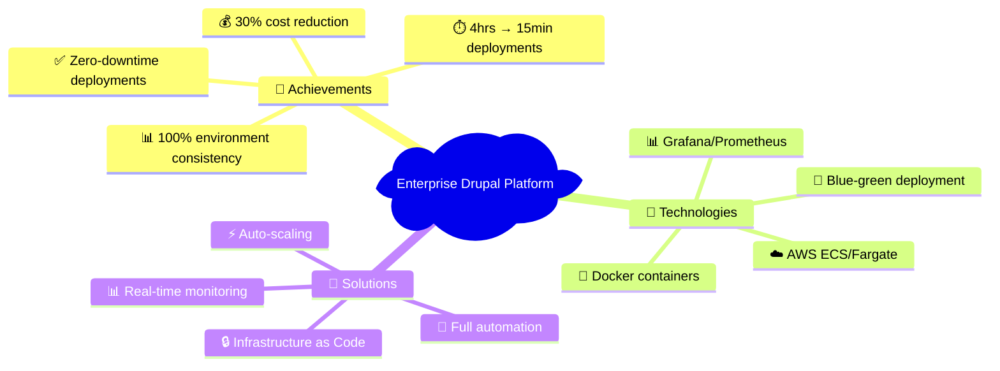
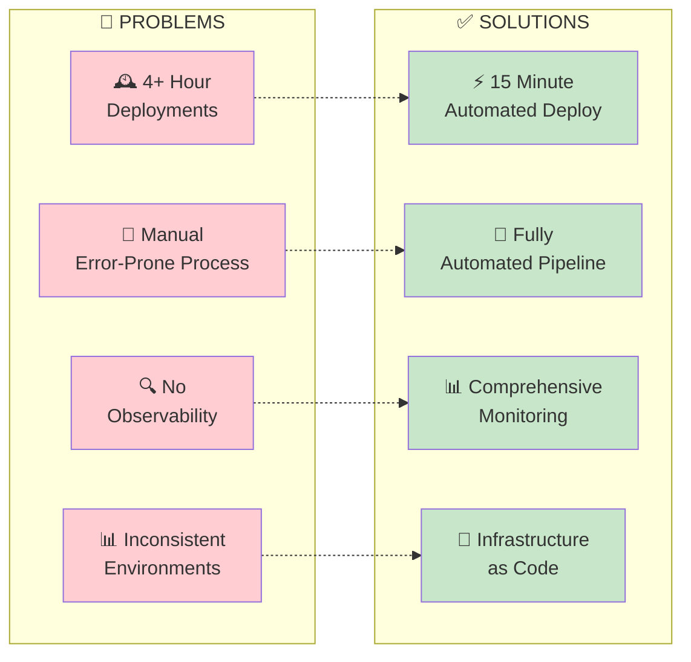

# Enterprise Drupal AWS Deployment Platform

## Project Overview

## The Challenge: From Manual to Automated

## Solution Architecture

### Infrastructure Design
- **AWS ECS Fargate**: Containerized application deployment
- **Multi-environment strategy**: Isolated dev, staging, and production environments
- **Infrastructure as Code**: Terraform and CloudFormation for reproducible deployments
- **Container orchestration**: Docker-based application packaging

### Monitoring & Observability
- **Grafana dashboards**: Real-time application and infrastructure metrics
- **Loki log aggregation**: Centralized logging with structured queries
- **Prometheus metrics**: Custom application metrics and alerting
- **Health checks**: Automated monitoring of critical application endpoints

### Deployment Automation
- **CI/CD pipeline**: Automated testing, building, and deployment
- **Environment promotion**: Controlled progression from dev → staging → production
- **Rollback capabilities**: Quick recovery from failed deployments
- **Configuration management**: Environment-specific settings handled securely

## Key Achievements

- **Deployment time**: Reduced from 4+ hours to under 15 minutes
- **Environment consistency**: 100% reproducible environments via IaC
- **Monitoring coverage**: Comprehensive observability across all application layers
- **Zero-downtime deployments**: Blue-green deployment strategy implemented
- **Cost optimization**: Right-sized infrastructure based on actual usage patterns

## Technologies Used

- **Cloud**: AWS (ECS, CloudWatch, ALB, RDS)
- **Containerization**: Docker, Docker Compose
- **Monitoring**: Grafana, Prometheus, Loki, Promtail
- **Infrastructure**: Terraform, CloudFormation
- **Application**: Drupal, PHP, MySQL
- **CI/CD**: Custom deployment scripts, automated testing

## Technical Highlights

### Container Strategy
Implemented multi-stage Docker builds optimizing for both development speed and production efficiency, with separate containers for web server, application code, and background processes.

### Monitoring Implementation
Built custom Prometheus exporters for Drupal-specific metrics, created comprehensive Grafana dashboards for both technical and business metrics, and implemented intelligent alerting to reduce noise.

### Security Considerations
Implemented least-privilege IAM roles, encrypted data at rest and in transit, and established secure secrets management across all environments.

## Lessons Learned

- **Start with monitoring**: Observability should be built in from day one, not added later
- **Environment parity**: Keeping dev/staging/prod identical prevents deployment surprises
- **Automation investment**: Time spent on automation pays dividends in reliability and speed
- **Documentation matters**: Clear runbooks and architecture docs are crucial for team adoption

## Impact

This platform became the foundation for multiple other applications, demonstrating the value of investing in robust deployment infrastructure. The monitoring and automation patterns were adopted across other projects, significantly improving overall team productivity and system reliability.