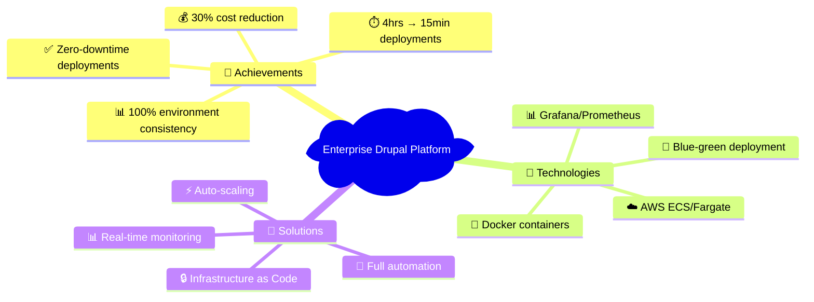

# Enterprise Drupal AWS Deployment Platform

## Project Overview

This is a bit inaccurate but a cool example of mindmap

```mermaid
mindmap
  root)Enterprise Drupal Platform(
    🚀 Achievements
      ⏱️ 4hrs → 15min deployments
      📊 100% environment consistency
      ✅ Zero-downtime deployments
      💰 30% cost reduction
    🔧 Technologies
      ☁️ AWS ECS/Fargate
      🐳 Docker containers
      📊 Grafana/Prometheus
      🚀 Blue-green deployment
    🎯 Solutions
      🤖 Full automation
      📊 Real-time monitoring
      🔒 Infrastructure as Code
      ⚡ Auto-scaling
```