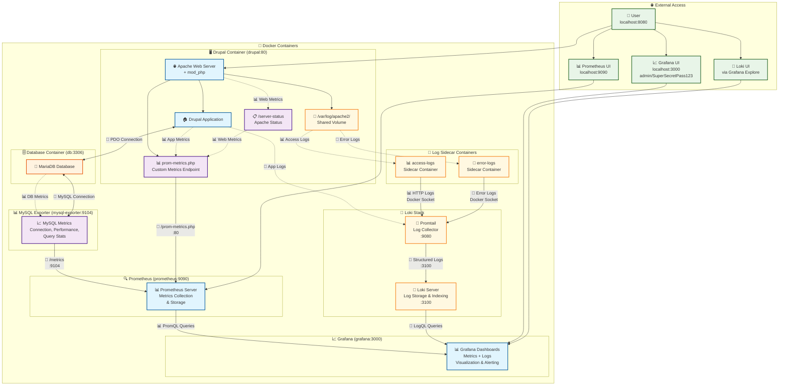
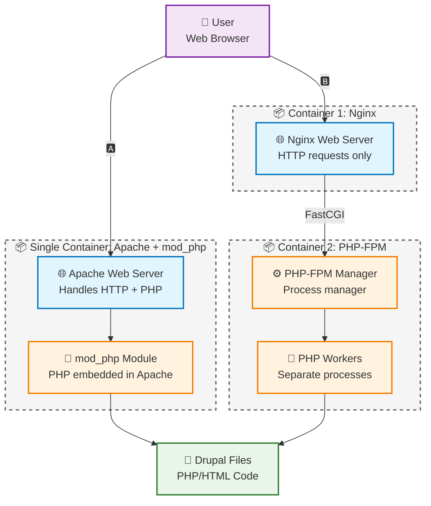

# 🏗️ APM Architecture Overview

## 📊 Metrics & Logs Endpoints Summary

### 📊 Prometheus Metrics
| 🎯 **Endpoint** | 🏠 **Location** | 📊 **Metrics Provided** | 🔄 **Scraped By** |
|----------------|----------------|------------------------|-------------------|
| 📊 `/prom-metrics.php` | `drupal:80` | 🐘 PHP Config, 🏠 Drupal App, 🗄️ Database Health, 🌐 Apache Stats, 📈 Memory per Request | 📊 Prometheus |
| 📈 `/metrics` | `mysql-exporter:9104` | 🐬 MySQL Performance, Connections, Queries | 📊 Prometheus |
| 📋 `/server-status` | `drupal:80` | 🌐 Apache Requests, Workers, Load | 📊 prom-metrics.php |

### 📝 Loki Log Sources
| 🎯 **Log Source** | 🏠 **Location** | 📝 **Log Data** | 🔄 **Collected By** |
|----------------|----------------|------------------------|-------------------|
| 📊 `access-logs` | `access-logs` sidecar | 🌐 HTTP Requests, Status Codes, Response Times, URLs | 🔄 Promtail |
| 🚨 `error-logs` | `error-logs` sidecar | 🚨 Apache Errors, Log Levels, Error Messages | 🔄 Promtail |
| 🏠 `drupal` | `drupal:80` container | 📝 Drupal Application Logs, PHP Errors | 🔄 Promtail |

## ⏱️ Scraping & Execution Frequency

### 📊 Prometheus Metrics Collection
| 🔄 **Component** | ⏰ **Frequency** | 📊 **What Happens** | 💾 **Data Volume** | ⚡ **Performance Impact** |
|-----------------|-----------------|-------------------|-------------------|-------------------------|
| **Prometheus → prom-metrics.php** | Every 15s | Full PHP script execution | ~50 metrics | Low - lightweight script |
| **prom-metrics.php → server-status** | Every 15s | HTTP request to localhost | ~10 Apache metrics | Very Low - local request |
| **prom-metrics.php → Database** | Every 15s | 6 SQL queries (nodes, users, errors) | ~6 metrics | Low - simple COUNT queries |
| **Prometheus → mysql-exporter** | Every 15s | MySQL connection + metrics query | ~100+ MySQL metrics | Medium - full DB stats |

### 📝 Loki Log Collection
| 🔄 **Component** | ⏰ **Frequency** | 📝 **What Happens** | 💾 **Data Volume** | ⚡ **Performance Impact** |
|-----------------|-----------------|-------------------|-------------------|-------------------------|
| **Promtail → access-logs** | Real-time | Docker socket log streaming | All HTTP requests | Very Low - streaming |
| **Promtail → error-logs** | Real-time | Docker socket log streaming | Apache errors only | Very Low - streaming |
| **Promtail → drupal** | Real-time | Docker socket log streaming | Drupal app logs | Very Low - streaming |
| **Promtail → Loki** | Real-time | Structured log ingestion | Parsed + labeled logs | Low - efficient protocol |

### 📈 HTTP Status Code & Response Time Processing

**Via Loki (Real-time):**
- **Log Streaming**: Real-time via Docker socket (no file I/O)
- **Parsing**: Promtail regex extracts status codes, response times, URLs, methods
- **Storage**: Structured logs with labels in Loki
- **Queries**: `{job="access-logs", status="500"}` for instant filtering
- **Performance**: Zero impact on application - pure log streaming

**Benefits over file parsing:**
- ✅ Real-time data (not 15s delayed)
- ✅ All requests captured (not just last 1000)
- ✅ Zero application performance impact
- ✅ Rich querying with LogQL

## 🔄 Data Flow

1. **📊 Metrics Generation**:
   - 🐘 **PHP/Drupal**: Custom `prom-metrics.php` generates comprehensive application metrics
   - 🐬 **MySQL**: Dedicated exporter connects to database and exposes performance metrics
   - 🌐 **Apache**: Status module + access logs provide web server metrics, consumed by `prom-metrics.php`

2. **🔍 Metrics Collection**:
   - 📊 **Prometheus** scrapes all endpoints every 15 seconds
   - 💾 **Storage**: Time-series data stored in Prometheus TSDB
   - 🎯 **Targets**: All endpoints monitored via `/targets` page

3. **📈 Visualization**:
   - 📊 **Grafana** queries Prometheus using PromQL
   - 📋 **Dashboards**: Real-time visualization of all metrics
   - 🚨 **Alerting**: Can be configured for threshold-based alerts

## PHP-FPM vs Apache Architecture

**Key Differences:**

| Aspect | 🅰️ Apache + mod_php (Our Choice) | 🅱️ Nginx + PHP-FPM |
|--------|-----------------------------------|---------------------|
| **Architecture** | Monolithic (one process) | Separated (two services) |
| **PHP Execution** | Inside Apache processes | Separate PHP processes |
| **Process Management** | Apache handles everything | PHP-FPM manages PHP workers |
| **Deployment** | Single container | Multiple containers |
| **Configuration** | Simpler | More complex |
| **Resource Isolation** | Shared memory space | Better isolation |
| **Monitoring** | Apache server-status + custom metrics | PHP-FPM status + Nginx metrics |
| **Use Case** | Traditional LAMP, simpler setups | High-traffic, microservices |
