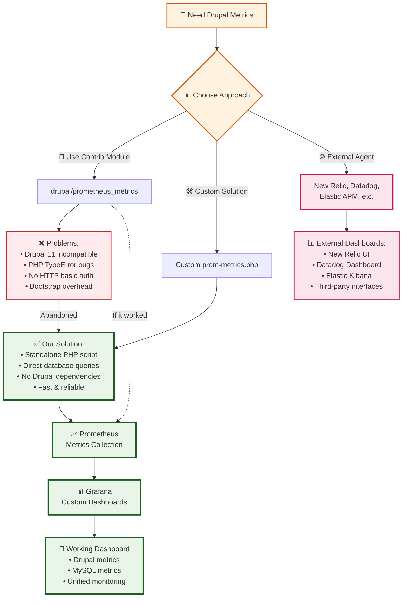

# 🎯 Drupal Metrics Strategy Decision

## How we got here



## Our solution

`/prom-metrics.php` is a metrics endpoint with:

- 🚀 **No Drupal bootstrap** - Direct PHP Data Objects database connection (100ms+ saved per request)
- 📊 **Comprehensive metrics** - PHP configuration, Apache processes, Drupal application data
- 🔧 **Apache integration** - Real server-status metrics via `apache_monitoring_setup.sh`
- 🛠️ **Single file solution** - Easy to debug, maintain, and deploy
- ⚠️ **SECURITY NOTE** - It is publicly accessible since it's a standalone PHP script.

Key metrics:

```
# PHP & Apache Metrics
php_memory_usage_bytes, php_memory_limit_bytes
apache_requests_total, apache_workers_busy

# Drupal Application Metrics
drupal_database_up, drupal_users_total
drupal_nodes_total, drupal_errors_24h
drupal_query_execution_time_seconds
```

## Detailed Implementation Notes

### Drupal Prometheus Contrib Module

There were multiple problems with contrib modules:

- `drupal/prometheus_exporter` doesn't support Drupal 11
- `drupal/prometheus_metrics:^1.0@alpha` had PHP TypeError bugs
